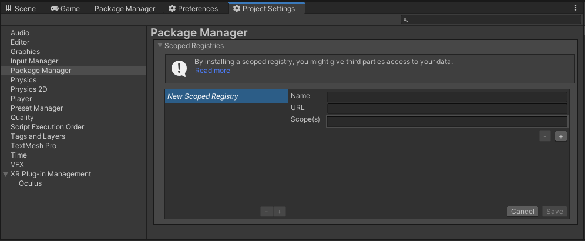
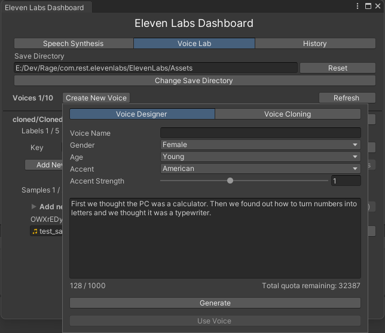

# com.rest.elevenlabs

[](https://discord.gg/xQgMW9ufN4)
[](https://openupm.com/packages/com.rest.elevenlabs/)

A non-official [ElevenLabs](https://elevenlabs.io) voice synthesis RESTful client for the [Unity](https://unity.com/) Game Engine.

Based on [ElevenLabs-DotNet](https://github.com/RageAgainstThePixel/ElevenLabs-DotNet)

I am not affiliated with ElevenLabs and an account with api access is required.

***All copyrights, trademarks, logos, and assets are the property of their respective owners.***

## Installing

### Via Unity Package Manager and OpenUPM

- Open your Unity project settings
- Select the `Package Manager`

- Add the OpenUPM package registry:
  - Name: `OpenUPM`
  - URL: `https://package.openupm.com`
  - Scope(s):
    - `com.rest.elevenlabs`
    - `com.utilities`
- Open the Unity Package Manager window
- Change the Registry from Unity to `My Registries`
- Add the `ElevenLabs` package

### Via Unity Package Manager and Git url

- Open your Unity Package Manager
- Add package from git url: `https://github.com/RageAgainstThePixel/com.rest.elevenlabs.git#upm`
  > Note: this repo has dependencies on other repositories! You are responsible for adding these on your own.
  - [com.utilities.async](https://github.com/RageAgainstThePixel/com.utilities.async)
  - [com.utilities.audio](https://github.com/RageAgainstThePixel/com.utilities.audio)
  - [com.utilities.rest](https://github.com/RageAgainstThePixel/com.utilities.rest)

---

## Documentation

### Table of Contents

- [Authentication](#authentication)
- [API Proxy](#api-proxy) :new:
- [Editor Dashboard](#editor-dashboard)
  - [Speech Synthesis](#speech-synthesis)
  - [Voice Lab](#voice-lab)
    - [Voice Designer](#voice-designer)
    - [Voice Cloning](#voice-cloning)
  - [History](#history)
- [Text to Speech](#text-to-speech)
  - [Stream Text to Speech](#stream-text-to-speech)
- [Voices](#voices)
  - [Get All Voices](#get-all-voices)
  - [Get Default Voice Settings](#get-default-voice-settings)
  - [Get Voice](#get-voice)
  - [Edit Voice Settings](#edit-voice-settings)
  - [Add Voice](#add-voice)
  - [Edit Voice](#edit-voice)
  - [Delete Voice](#delete-voice)
  - [Samples](#samples)
    - [Get Voice Sample](#get-voice-sample)
    - [Delete Voice Sample](#delete-voice-sample)
- [History](#history)
  - [Get History](#get-history)
  - [Get History Audio](#get-history-audio)
  - [Download All History](#download-all-history)
  - [Delete History Item](#delete-history-item)
- [User](#user)
  - [Get User Info](#get-user-info)
  - [Get Subscription Info](#get-subscription-info)

### Authentication

There are 4 ways to provide your API keys, in order of precedence:

1. [Pass keys directly with constructor](#pass-keys-directly-with-constructor)
2. [Unity Scriptable Object](#unity-scriptable-object)
3. [Load key from configuration file](#load-key-from-configuration-file)
4. [Use System Environment Variables](#use-system-environment-variables)

#### Pass keys directly with constructor

```csharp
var api = new ElevenLabsClient("yourApiKey");
```

Or create a `ElevenLabsAuthentication` object manually

```csharp
var api = new ElevenLabsClient(new ElevenLabsAuthentication("yourApiKey"));
```

#### Unity Scriptable Object

You can save the key directly into a scriptable object that is located in the `Assets/Resources` folder.

You can create a new one by using the context menu of the project pane and creating a new `ElevenLabsConfiguration` scriptable object.


#### Load key from configuration file

Attempts to load api keys from a configuration file, by default `.elevenlabs` in the current directory, optionally traversing up the directory tree or in the user's home directory.

To create a configuration file, create a new text file named `.elevenlabs` and containing the line:

##### Json format

```json
{
  "apiKey": "yourApiKey",
}
```

You can also load the file directly with known path by calling a static method in Authentication:

```csharp
var api = new ElevenLabsClient(ElevenLabsAuthentication.Default.LoadFromDirectory("your/path/to/.elevenlabs"));;
```

#### Use System Environment Variables

Use your system's environment variables specify an api key to use.

- Use `ELEVEN_LABS_API_KEY` for your api key.

```csharp
var api = new ElevenLabsClient(ElevenLabsAuthentication.Default.LoadFromEnvironment());
```

### [API Proxy](https://github.com/RageAgainstThePixel/ElevenLabs-DotNet/main/ElevenLabs-DotNet-Proxy/README.md)

[](https://www.nuget.org/packages/ElevenLabs-DotNet-Proxy/)

Using either the [ElevenLabs-DotNet](https://github.com/RageAgainstThePixel/ElevenLabs-DotNet) or [com.rest.elevenlabs](https://github.com/RageAgainstThePixel/com.rest.elevenlabs) packages directly in your front-end app may expose your API keys and other sensitive information. To mitigate this risk, it is recommended to set up an intermediate API that makes requests to ElevenLabs on behalf of your front-end app. This library can be utilized for both front-end and intermediary host configurations, ensuring secure communication with the ElevenLabs API.

#### Front End Example

In the front end example, you will need to securely authenticate your users using your preferred OAuth provider. Once the user is authenticated, exchange your custom auth token with your API key on the backend.

Follow these steps:

1. Setup a new project using either the [ElevenLabs-DotNet](https://github.com/RageAgainstThePixel/ElevenLabs-DotNet) or [com.rest.elevenlabs](https://github.com/RageAgainstThePixel/com.rest.elevenlabs) packages.
2. Authenticate users with your OAuth provider.
3. After successful authentication, create a new `ElevenLabsAuthentication` object and pass in the custom token.
4. Create a new `ElevenLabsSettings` object and specify the domain where your intermediate API is located.
5. Pass your new `auth` and `settings` objects to the `ElevenLabsClient` constructor when you create the client instance.

Here's an example of how to set up the front end:

```csharp
var authToken = await LoginAsync();
var auth = new ElevenLabsAuthentication(authToken);
var settings = new ElevenLabsSettings(domain: "api.your-custom-domain.com");
var api = new ElevenLabsClient(auth, settings);
```

This setup allows your front end application to securely communicate with your backend that will be using the ElevenLabs-DotNet-Proxy, which then forwards requests to the ElevenLabs API. This ensures that your ElevenLabs API keys and other sensitive information remain secure throughout the process.

#### Back End Example

In this example, we demonstrate how to set up and use `ElevenLabsProxyStartup` in a new ASP.NET Core web app. The proxy server will handle authentication and forward requests to the ElevenLabs API, ensuring that your API keys and other sensitive information remain secure.

1. Create a new [ASP.NET Core minimal web API](https://learn.microsoft.com/en-us/aspnet/core/tutorials/min-web-api?view=aspnetcore-6.0) project.
2. Add the ElevenLabs-DotNet nuget package to your project.
    - Powershell install: `Install-Package ElevenLabs-DotNet-Proxy`
    - Manually editing .csproj: `<PackageReference Include="ElevenLabs-DotNet-Proxy" />`
3. Create a new class that inherits from `AbstractAuthenticationFilter` and override the `ValidateAuthentication` method. This will implement the `IAuthenticationFilter` that you will use to check user session token against your internal server.
4. In `Program.cs`, create a new proxy web application by calling `ElevenLabsProxyStartup.CreateDefaultHost` method, passing your custom `AuthenticationFilter` as a type argument.
5. Create `ElevenLabsAuthentication` and `ElevenLabsClientSettings` as you would normally with your API keys, org id, or Azure settings.

```csharp
public partial class Program
{
    private class AuthenticationFilter : AbstractAuthenticationFilter
    {
        public override void ValidateAuthentication(IHeaderDictionary request)
        {
            // You will need to implement your own class to properly test
            // custom issued tokens you've setup for your end users.
            if (!request["xi-api-key"].ToString().Contains(userToken))
            {
                throw new AuthenticationException("User is not authorized");
            }
        }
    }

    public static void Main(string[] args)
    {
        var client = new ElevenLabsClient();
        var proxy = ElevenLabsProxyStartup.CreateDefaultHost<AuthenticationFilter>(args, client);
        proxy.Run();
    }
}
```

Once you have set up your proxy server, your end users can now make authenticated requests to your proxy api instead of directly to the ElevenLabs API. The proxy server will handle authentication and forward requests to the ElevenLabs API, ensuring that your API keys and other sensitive information remain secure.

### Editor Dashboard

You can perform all of the same actions from the ElevenLabs website, in the Editor using the ElevenLabs Dashboard!


#### Speech Synthesis

Just like in the ElevenLabs website, you can synthesize new audio clips using available voices. This tool makes it even more handy as the clips are automatically downloaded and imported into your project, ready for you to use!


#### Voice Lab

Just like in the ElevenLabs website, you can manage all your voices directly in the editor.


##### Voice Designer

Selecting `Create New Voice` will display a popup where you can design entirely new voices using ElevenLabs generative models.



##### Voice Cloning

Additionally, you're also able to clone a voice from sample recordings.


#### History

You also have access to the full list of all your generated samples, ready for download.


### [Text to Speech](https://api.elevenlabs.io/docs#/text-to-speech)

Convert text to speech.

```csharp
var api = new ElevenLabsClient();
var text = "The quick brown fox jumps over the lazy dog.";
var voice = (await api.VoicesEndpoint.GetAllVoicesAsync()).FirstOrDefault();
var defaultVoiceSettings = await api.VoicesEndpoint.GetDefaultVoiceSettingsAsync();
var (clipPath, audioClip) = await api.TextToSpeechEndpoint.TextToSpeechAsync(text, voice, defaultVoiceSettings);
Debug.Log(clipPath);
```

> Note, only a single audio clip is created per text string. If you'd like to get different variations of the audio, you'll need to pass in `deleteCachedFile: true`.

### Stream Text to Speech

:warning: WARNING :bangbang: This feature is experimental, and may not work as expected! Unity doesn't seem to respect streaming when setting [`DownloadHandlerAudioClip.streamAudio`](https://docs.unity3d.com/ScriptReference/Networking.DownloadHandlerAudioClip-streamAudio.html) to true.

```csharp
var api = new ElevenLabsClient();
var text = "The quick brown fox jumps over the lazy dog.";
var voice = (await api.VoicesEndpoint.GetAllVoicesAsync()).FirstOrDefault();
var defaultVoiceSettings = await api.VoicesEndpoint.GetDefaultVoiceSettingsAsync();
var (clipPath, audioClip) = await api.TextToSpeechEndpoint.StreamTextToSpeechAsync(
    text,
    voice,
    clip =>
    {
        // Event raised as soon as the clip has loaded enough data to play.
        // May not provide or play full clip until Unity bug is addressed.
        audioSource.PlayOneShot(clip);
    },
    defaultVoiceSettings);
Debug.Log(clipPath);
```

### [Voices](https://api.elevenlabs.io/docs#/voices)

Access to voices created either by the user or ElevenLabs.

#### Get All Voices

Gets a list of all available voices.

```csharp
var api = new ElevenLabsClient();
var allVoices = await api.VoicesEndpoint.GetAllVoicesAsync();

foreach (var voice in allVoices)
{
    Debug.Log($"{voice.Id} | {voice.Name} | similarity boost: {voice.Settings?.SimilarityBoost} | stability: {voice.Settings?.Stability}");
}
```

#### Get Default Voice Settings

Gets the global default voice settings.

```csharp
var api = new ElevenLabsClient();
var result = await api.VoicesEndpoint.GetDefaultVoiceSettingsAsync();
Debug.Log($"stability: {result.Stability} | similarity boost: {result.SimilarityBoost}");
```

#### Get Voice

```csharp
var api = new ElevenLabsClient();
var voice = await api.VoicesEndpoint.GetVoiceAsync("voiceId");
Debug.Log($"{voice.Id} | {voice.Name} | {voice.PreviewUrl}");
```

#### Edit Voice Settings

Edit the settings for a specific voice.

```csharp
var api = new ElevenLabsClient();
var success = await api.VoicesEndpoint.EditVoiceSettingsAsync(voice, new VoiceSettings(0.7f, 0.7f));
Debug.Log($"Was successful? {success}");
```

#### Add Voice

```csharp
var api = new ElevenLabsClient();
var labels = new Dictionary<string, string>
{
    { "accent", "american" }
};
var audioSamplePaths = new List<string>();
var voice = await api.VoicesEndpoint.AddVoiceAsync("Voice Name", audioSamplePaths, labels);
```

#### Edit Voice

```csharp
var api = new ElevenLabsClient();
var labels = new Dictionary<string, string>
{
    { "age", "young" }
};
var audioSamplePaths = new List<string>();
var success = await api.VoicesEndpoint.EditVoiceAsync(voice, audioSamplePaths, labels);
Debug.Log($"Was successful? {success}");
```

#### Delete Voice

```csharp
var api = new ElevenLabsClient();
var success = await api.VoicesEndpoint.DeleteVoiceAsync(voiceId);
Debug.Log($"Was successful? {success}");
```

#### [Samples](https://api.elevenlabs.io/docs#/samples)

Access to your samples, created by you when cloning voices.

##### Get Voice Sample

```csharp
var api = new ElevenLabsClient();
var audioClip = await api.VoicesEndpoint.GetVoiceSampleAsync(voiceId, sampleId);
```

##### Delete Voice Sample

```csharp
var api = new ElevenLabsClient();
var success = await api.VoicesEndpoint.DeleteVoiceSampleAsync(voiceId, sampleId);
Debug.Log($"Was successful? {success}");
```

### [History](https://api.elevenlabs.io/docs#/history)

Access to your previously synthesized audio clips including its metadata.

#### Get History

```csharp
var api = new ElevenLabsClient();
var historyItems = await api.HistoryEndpoint.GetHistoryAsync();

foreach (var historyItem in historyItems.OrderBy(historyItem => historyItem.Date))
{
    Debug.Log($"{historyItem.State} {historyItem.Date} | {historyItem.Id} | {historyItem.Text.Length} | {historyItem.Text}");
}
```

#### Get History Audio

```csharp
var api = new ElevenLabsClient();
var audioClip = await api.HistoryEndpoint.GetHistoryAudioAsync(historyItem);
```

#### Download All History

```csharp
var api = new ElevenLabsClient();
var success = await api.HistoryEndpoint.DownloadHistoryItemsAsync();
```

#### Delete History Item

```csharp
var api = new ElevenLabsClient();
var result = await api.HistoryEndpoint.DeleteHistoryItemAsync(historyItem);
Debug.Log($"Was successful? {success}");
```

### [User](https://api.elevenlabs.io/docs#/user)

Access to your user Information and subscription status.

#### Get User Info

Gets information about your user account with ElevenLabs.

```csharp
var api = new ElevenLabsClient();
var userInfo = await api.UserEndpoint.GetUserInfoAsync();
```

#### Get Subscription Info

Gets information about your subscription with ElevenLabs.

```csharp
var api = new ElevenLabsClient();
var subscriptionInfo = await api.UserEndpoint.GetSubscriptionInfoAsync();
```
